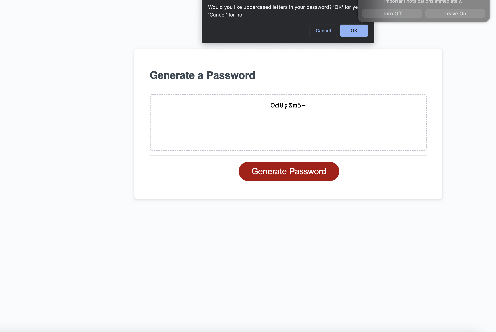

# <My Random Password Generator>

## Description

Since coming up with passwords is always so difficult, this random password generator will allow a user to select what types of characters they would like in their password (uppercase, lowercase, numbers, and special characters) and how many characters they would like in their password. Once the user has selected their preferences, the generator will pick random characters amongst the possible datasets and print out a new, random password for the user. The user can repeat this as many times as they need.

In order to create this app, I used starter HTML and CSS code (supplied by UCLA Extension). I then created the JS to incorporate functionality into the app. Upon establishing the possible variables, I used a while loop and if statements to help construct the new password before the system prints it out to the reader. I also added functionality so that clicking on the button generate would start the prompts again once a password has been generated the first time. 

## Site Screenshot

## Credits

Thanks to UCLA Extension for supplying the HTML and CSS starter code. 

## Live Link
https://cmckee120993.github.io/random-password-generator/
